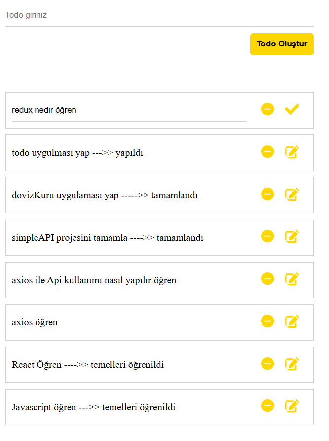

# React Todo Application



## 🚀 Proje Hakkında

Bu proje, React kullanılarak geliştirilmiş modern bir Todo List uygulamasıdır. Kullanıcılar günlük görevlerini kolayca yönetebilir, yeni görevler ekleyebilir, düzenleyebilir ve silebilirler.

## ✨ Özellikler

- Todo ekleme
- Todo silme
- Todo düzenleme
- Responsive tasarım
- Modern ve kullanıcı dostu arayüz

## 🛠️ Kullanılan Teknolojiler

- React.js
- CSS3
- React Icons
- JavaScript (ES6+)

## 🔧 Kurulum

Projeyi lokalde çalıştırmak için aşağıdaki adımları takip edin:

1. Projeyi klonlayın
```bash
git clone https://github.com/kadirn7/Todo-toDoReact
```

2. Proje klasörüne gidin
```bash
cd Todo-toDoReact
```

3. Gerekli paketleri yükleyin
```bash
npm install
```

4. Uygulamayı başlatın
```bash
npm run dev
```

## 💻 Kullanım

1. Yeni todo eklemek için input alanına görev yazın ve "Todo Oluştur" butonuna tıklayın
2. Mevcut todoyu düzenlemek için kalem ikonuna tıklayın
3. Düzenlemeyi kaydetmek için tik ikonuna tıklayın
4. Todoyu silmek için çarpı ikonuna tıklayın

## 🤝 Katkıda Bulunma

1. Bu projeyi fork edin
2. Feature branch oluşturun (`git checkout -b feature/amazing-feature`)
3. Değişikliklerinizi commit edin (`git commit -m 'feat: Add amazing feature'`)
4. Branch'inizi push edin (`git push origin feature/amazing-feature`)
5. Pull Request oluşturun

## 📝 Lisans

Bu proje MIT lisansı altında lisanslanmıştır. Daha fazla bilgi için `LICENSE` dosyasına bakınız.

## 📧 İletişim

Proje Sahibi: [İsim Soyisim]
Proje Link: [https://github.com/kadirn7/Todo-toDoReact](https://github.com/kadirn7/Todo-toDoReact)

---
⭐️ Bu projeyi beğendiyseniz yıldız vermeyi unutmayın!

## 📦 Projeyi Oluşturan Kişiler

- [Kadir Paşaoğlu](https://github.com/kadirn7)


